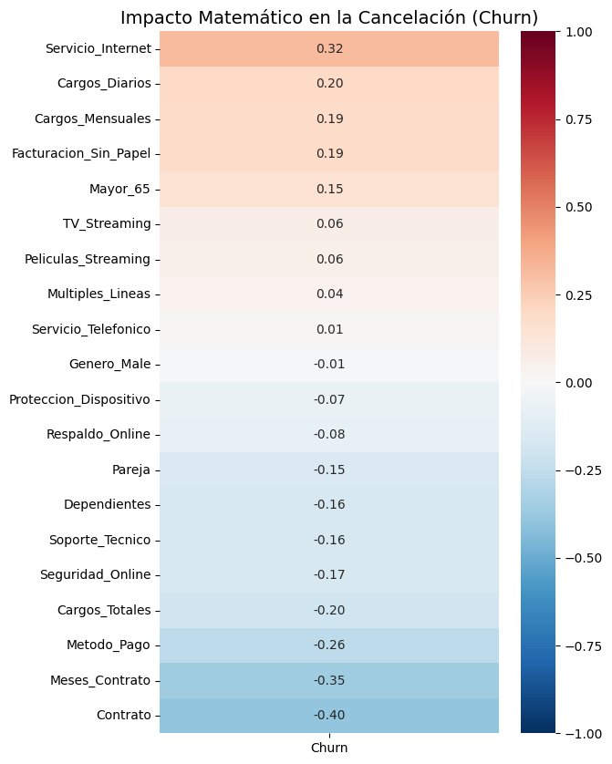
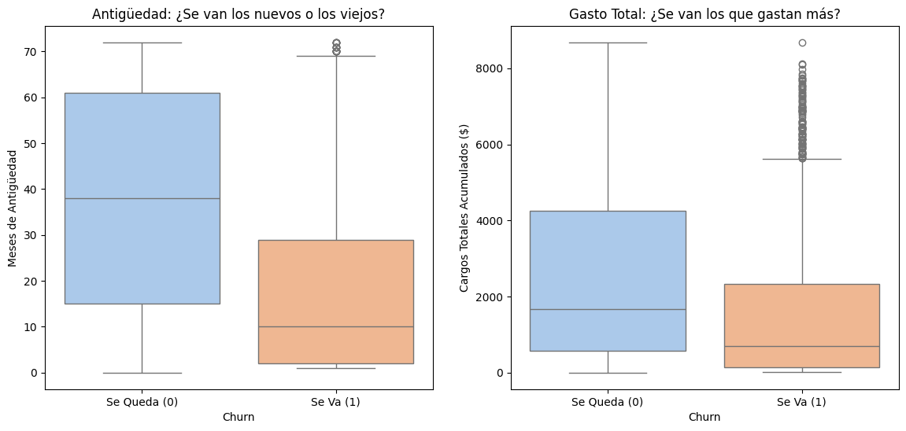
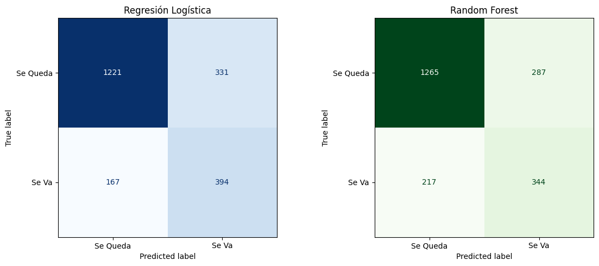
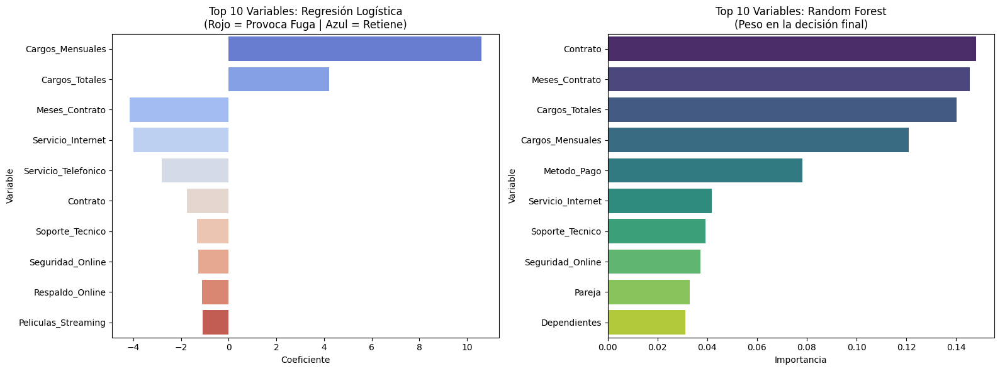

# Telecom X Latam: Customer Churn Prediction


## 📋 Executive Summary
This project delivers the **Machine Learning and Predictive Modeling** phase for a telecommunications provider. Building upon previous exploratory analysis, I engineered a robust predictive pipeline handling severe class imbalances to identify at-risk customers. The final model achieves a **70% Recall rate**, providing actionable intelligence to mitigate the 26.5% global churn rate.

> **Context:** Developed as part of the **Oracle Next Education (ONE)** specialization in Data Science & Analytics.

---
## 📂 Project Structure

```text
telecom-churn-prediction/
│
├── data/
│   └── datos_tratados.csv               # Cleaned and numerically encoded dataset
├── images/                              # Exported ML visualizations for documentation
│   ├── boxplots_churn.png
│   ├── confusion_matrix.png
│   ├── correlation_heatmap.png
│   └── feature_importance_ml.png
├── README.md                            # Project documentation and strategic insights
└── TelecomX_Predictive_Model.ipynb      # Main Jupyter Notebook (SMOTE, Pipeline & ML)
```
---

## 🔍 Key Strategic Findings

### 1. The "Short-Term Trap" 📉
The predictive model's coefficients heavily penalize **Month-to-Month Contracts** and low **Tenure**. Customers lack an anchoring mechanism to the company.
* **Insight:** Early lifecycle volatility is the primary driver of churn.
* **Strategy:** Implement aggressive early-retention campaigns, offering discounts during the first 3 months if users transition to annual billing.

### 2. The Fiber Optic Flaw ⚡
Mathematical analysis confirms that **Fiber Optic** internet is one of the strongest predictors *for* cancellation, contrary to expectations of it being a premium retention product.
* **Strategy:** Trigger an immediate technical and pricing audit of the Fiber Optic infrastructure.

### 3. The Lack of Ecosystem 🛡️
Customers without bundled add-ons (like **Online Security** or **Tech Support**) are highly prone to leave. 
* **Strategy:** Deploy defensive bundles. Offering 3 free months of Tech Support to new users increases exit friction and intertwines them into the telecom ecosystem.

---

## 📊 Predictive Analysis Gallery

### 1. The Churn Radar (Correlation Map)

<div align="center">
  
</div>

> **Insight:** Before modeling, the mathematical radar isolated the variables. Tenure acts as a strong anchor (negative correlation to churn), while specific categorical features (like Fiber Optic) drive the exit.

---

### 2. Identifying the Target (Distributions)

<div align="center">
  
</div>

> **Insight:** Visualizing distributions proves that churn is heavily skewed toward newer customers with lower lifetime accrued charges, confirming the "Short-Term Trap" hypothesis.

---

### 3. Model Evaluation (The Verdict)

<div align="center">
  
</div>

> **Insight:** Logistic Regression outperformed Random Forest in the business-critical metric: **Recall for the Churn class**. By catching 394 true potential churners (vs 344 from RF), it actively prevents significant revenue loss.

---

### 4. Extracting the DNA of Cancellation

<div align="center">
  
</div>

> **Insight:** Opening the algorithms' "black box". Logistic Regression coefficients (left) show us exactly which variables push the customer away (red) and which ones anchor them (blue).

---

## 🛠️ Technical Workflow
This project simulates a real-world predictive architecture task:
1.  **Preprocessing & Leakage Prevention:** Dropped noise features, applied One-Hot Encoding, and ensured strict Train/Test Splitting *prior* to any transformations to prevent Data Leakage.
2.  **Balancing & Scaling:** Applied **SMOTE** exclusively to the training set to resolve the 73/27 class imbalance, followed by `MinMaxScaler` normalization.
3.  **Modeling & Tuning:** Trained and evaluated Logistic Regression (distance-based) vs. Random Forest (tree-based) using precision, recall, f1-score, and confusion matrices.

---

## 👤 About the Author
**Kevin Mendoza**
* 🧪 **Biotechnology Engineer** * ⚙️ **Data Engineer** ````
